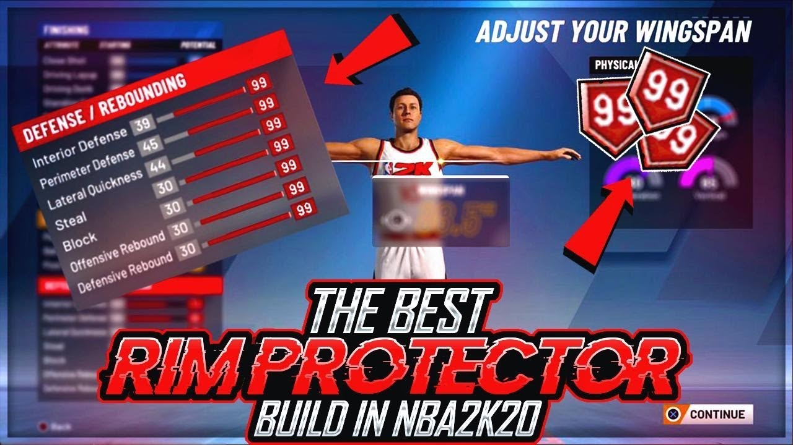

# About

2K is a basketball game where you can create your own character, play on any team, and play onlne in park with friends or random play to dominate the courrt

# Terminology

Noob: A new player
park: online games to play with friends in Mycareer

# builds

## Positions

- **Point Guard**
- **Shooting Guard**
- **Small Forward**
- **Power Forward**
- **Center**

## Archetypes

** *Point Guard* :**

- Sharpshooting Playmaker

- Playmaking Sharpshooter

- Shot-Creating Sharpshooter

- Shot-Creating Slasher

- Playmaking Shot Creator

*Shooting Guard* :

- Pure Sharpshooter

- Sharpshooting Shot Creator

- Pure Lockdown Defender

- Two Way Slasher

- Slashing Shot Creator

 *Small Forward* :

- Pure Lockdown Defender

- Two Way Sharpshooter

- Shot Creating Sharpshooter

- Slashing Defender

- Sharpshooting Slasher

 *Power Forward*:

- Sharpshooting Rebounder

- Slashing Stretch 4

- Shot Creating Post Scorer

- Two Way Athletic Finisher

- Sharpshooting Rim Protector

*Center *:

- Pure Glass Cleaner

- Pure Rim Protector

- Sharpshooting Rebounder

- Rebounding Post Scorer

- Rebounding Athletic Finisher

# The Creation

## Features

1. Facial Features
2. Bodily features(height and weight)

## Part 1:

You can use a face scanner if you would like

### Creating your Face

1. fully edit your cheeks,mouth,jaw,etes,nose,forehead, ears
2. customize your hair with many shades, color and designs

### Light Exercise

1. 1 Warmup set (10 reps)
2. 3 Working sets (8 reps)

## Part 2: Secondary Muscle Group (Superset)

Your *secondary muscle group* should be your *small muscle group* for the day. This is done in a superset so exercises are done back to back one set at a time.

### Heavy Exercise

1. 1 Warmup set (10 reps)
2. 4 Working sets (8 reps)

### Lighter Exercise

1. 3 Working sets (10 reps)

## Part 3: Muscle Group Closer

### Main Muscle Group Closer

1. 3 sets (10 reps)

### Secondary Muscle Group Closer

1. 3 sets (10 reps)

## Core (Superset)

### Abdominals

1. 3 sets

### Lower Back

1. 3 sets

# Exercises

## Big Muscle Groups

### Upper Back

#### Heavy

- Rows (Any Variant)
- Lat Pull Down

#### Light

- Pullups (Any Variant)
- Flys (Any Variant)

### Lower Back

#### Heavy

- Deadlift (Any Variant)
- Good Mornings

#### Light

- Superman
- Hyperextensions (Any Variant)
- Jefferson Curl

### Chest

#### Heavy

- Barbell Bench Press (Any Variant)
- Dumbbell Bench Press (Any Variant)

#### Light

- Pushups
- Cable Crossover (Any Variant)
- Dumbbell Flyes (Any Variant)

### Legs

#### Heavy

- Squats (Any Variant)
- Leg Press (Any Variant)
- Deadlift

#### Light

- Lunges
- Jump Rope
- Lying Leg Curls
- Leg Extensions

### Shoulders

#### Heavy

- Military Press
- Arnold Press
- Dumbbell Press
- Shrugs

#### Light

- Lateral Raise
- Front Raise
- Face Pull

## Small Muscle Groups

### Biceps

#### Heavy

- Hammer Curls
- Preacher Curls
- Barbell Curl
- Dumbbell Bicep Curl

#### Light

- EZ-Bar Curl
- 21s

### Triceps

#### Heavy

- Close Grip Bench Press
- Dumbell Tricep Extension
- Tricep Press

#### Light

- Dips
- Tricep Push Downs
- Skull Crushers

# Plans For Future Development

In the future, I would like to add more exercises, add a full sample workout routine, and add different workout formulas. In addition, I would like to add videos of each exercise or links to descriptions. In the far future I would like people to video tape themselves completing exercises and use image recognition software, artificial intelligence, and machine learning to analyze user's form completing exercises and offer suggestions for improvement.
